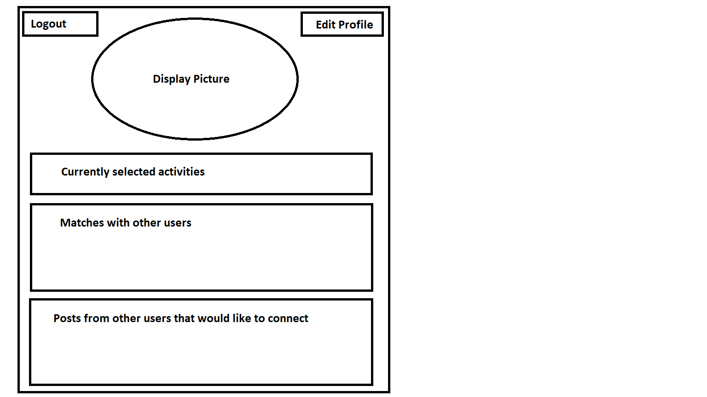

# Project Title

Palomino

## Overview

The idea is to help people find more friends through activities that they enjoy. It is a lot easier to meet and bond with people when you have something in common. The app will let you input various hobbies/activities ranging from runnning to tennis and will let you coordinate with people that share the same interests. A match maker for activities with a focus on making new friends.

### Problem

Making new friends as an adult is hard. Especially if you have to move for work and have to start from scratch. But, people usually still make time for their hobbies/activities such as going to the gym. Combining your existing hobbies with making new friends is an easy and comfortable way to grow your social circle. 

### User Profile

People looking for others to share their hobbies/activities with.
People that have difficulty making new friends.
People that dont feel like they have time to go out and meet new people organically.
People that have moved to a new location and don't really know anyone.
May have to allow people to filter the gender they are viewable to as this is not necessarily a dating app and some attention may be unwanted.

### Features

User Accounts
Accounts will have age, gender, location, and activity (as well as skill or intensity level ie. tennis - beginner, intermediate, expert)
Matches based on shared activities and location.
Users will be able to view matches and post on the page of their match if they would like to connect.
Users will be able to delete posts on their account.
Users will be able to create, edit, and delete accounts.

## Implementation

### Tech Stack

React
Scss
MySql
Express
Axios
Knex

### APIs

There will be no external sources of data at this time.

### Sitemap

### Mockups

#### Home page

- Logo and welcome message
- User login
- Edit account page
- Create account

#### Create account Page

- user name
- password
- email
- display picture
- bio
- activities
- location
- gender
- age
- distance preference
- who account is viewable to/limit matches based on age and gender

#### User page

- display picture
- activity list with option to add or remove activities
- matches
- posts
- edit account

#### Edit user page

- edit profile
- delete profile option

#### Match page

- display picture
- shared activites
- age, gender, rough distance

### Data

Users Database containing id and all information filled out in create account.

### Endpoints

**Create Account Page**
Parameters:
User provided data
Axios Post

[
    {
        "id": 1,
        "userName": The Chosen One"
        "password": "password"
        "email": "Th3Ch0s3n0ne@hotmail.com
        "displayPicture": image,
        "name": "Harry Potter",
        "Interests": "Quidditch",
        "bio": "insert bio here",
        "location": "Hogwarts",
        "gender": "Male",
        "age": 18,
        "distancePreference": 50km,
        "viewableTo": "all"
    }
]

**User Page**
Parameters:
User provided data/id
Axios get request

[
    {
        "id": 1,
        "password": "password"
        "displayPicture": image,
        "name": "Harry Potter",
        "Interests": "Quidditch",
        "bio": "insert bio here",
        "posts": "add post component"
    }
]

**Get matched users**
- Will pull users with matched interests that fall within specified distance
Parameters:
- User provided activity list
- User provided distance preference
- User provided gender preference
- longitude: User-provided location as a number
- latitude: User-provided location as a number

Response:
[
    {
        "id": 1,
        "name": "Harry Potter",
        "displayPicture": image,
        "sharedInterests": "Quidditch",
        "bio": "insert bio here",
        "gender": "male",
        "posts": "add post component"
    }
]

## Roadmap

- Create client
    - make pages with titles and routes
- Create server
- Create database
    - populate with dummy users
- Make components to complete all axios requests and make sure all data populates
- Create functions to sort data and ensure the right data is populating
- Add functionality to pages
- Add auth
- Style pages

## Nice-to-haves

Trending/popular activities that are suggested to the user
A live chat feature
Emails that update users for new matches 
Predictive text that autofills activities
A search function for activities that shows how popular they are in your area
Location Filter
JWT auth for user account creation and login

